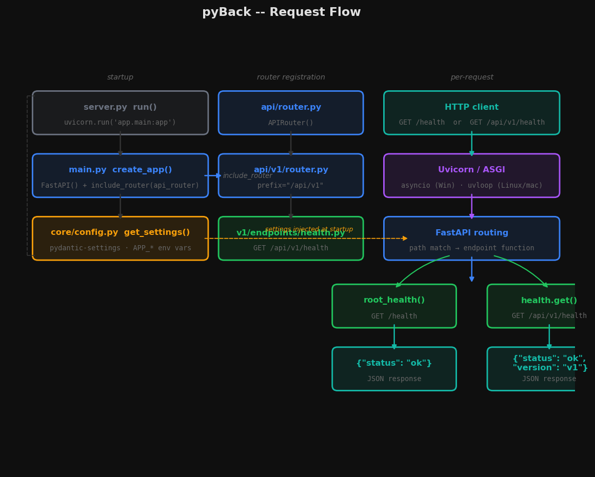

# pyBack

FastAPI backend scaffold managed by `uv`, using a `src` layout and versioned API routing.



## Structure

```text
src/
  app/
    api/
      v1/
        endpoints/
    core/
tests/
```

## Getting started

```powershell
uv sync --extra dev
uv run pyback
```

The server entrypoint detects Windows vs non-Windows:

- Windows uses the default `asyncio` loop.
- Linux/macOS uses `uvloop` when available.

## Development

```powershell
uv run uvicorn app.main:app --reload
uv run pytest
uv run ruff check .
```

## Default routes

- `GET /health`
- `GET /api/v1/health`
